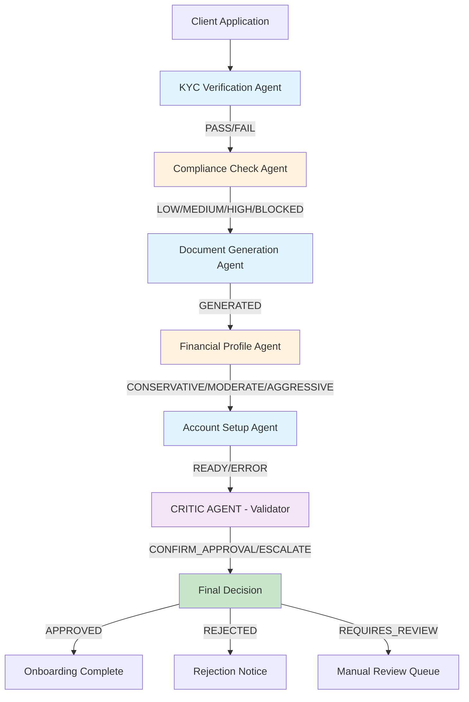

# Architecture: Client Onboarding Orchestrator

## System Architecture Diagram



## Component Descriptions

### 1. KYC Verification Agent (Haiku)
**Purpose**: Identity validation and document collection  
**Model**: claude-3-5-haiku (fast, cost-efficient)  
**Inputs**: Client name, email, provided documents  
**Outputs**: Structured decision (PASS/FAIL), missing documents list  
**Tools**: 
- `verify_identity_documents` → checks document types
- `validate_client_info` → regex/format validation
- `check_required_docs` → ensures completeness

---

### 2. Compliance Check Agent (Sonnet)
**Purpose**: Regulatory compliance assessment, sanctions screening  
**Model**: claude-3-5-sonnet (reasoning-heavy, nuanced)  
**Inputs**: Client name, address, income level, previous results from KYC  
**Outputs**: Risk level (LOW/MEDIUM/HIGH/BLOCKED), reasoning, flags  
**Tools**:
- `sanctions_list_check` → mock sanctions match
- `aml_risk_assessment` → anti-money laundering rules
- `pep_check` → politically exposed person database
- `categorize_risk` → assigns risk tier with reasoning

**Trust Boundary**: Financial regulation — all decisions logged with reasoning for audit trail.

---

### 3. Document Generation Agent (Haiku)
**Purpose**: Generate onboarding artifacts (contracts, forms, disclosures)  
**Model**: claude-3-5-haiku (template-based, straightforward)  
**Inputs**: Client profile, risk category, previous completions  
**Outputs**: Generated documents (JSON), signatures required  
**Tools**:
- `generate_onboarding_contract` → contract JSON
- `generate_risk_disclosure` → disclosure requirements
- `generate_consent_forms` → regulatory forms

---

### 4. Financial Profile Agent (Sonnet)
**Purpose**: Build client investment profile and risk assessment  
**Model**: claude-3-5-sonnet (judgment-required, complex reasoning)  
**Inputs**: Income, net worth, investment experience, risk tolerance  
**Outputs**: Investment strategy (CONSERVATIVE/MODERATE/AGGRESSIVE), recommended products  
**Tools**:
- `assess_risk_tolerance` → questionnaire analysis
- `profile_investment_strategy` → strategy recommendation
- `calculate_asset_allocation` → portfolio suggestion

---

### 5. Account Setup Agent (Haiku)
**Purpose**: Provision accounts, schedule follow-ups  
**Model**: claude-3-5-haiku (configuration, rule-based)  
**Inputs**: Client data, risk profile, strategy  
**Outputs**: Account IDs, setup complete, next steps  
**Tools**:
- `create_account` → mock account provisioning
- `schedule_advisor_meeting` → calendar entry
- `send_welcome_email` → notification template

---

### 6. CRITIC AGENT (Sonnet) — Validation Layer
**Purpose**: Meta-analysis of entire approval chain; detect hallucinations, inconsistencies, risk mismatches  
**Model**: claude-3-5-sonnet (meta-reasoning, validation)  
**Inputs**: All prior agent outputs (KYC result, Compliance risk, Profile strategy, etc.)  
**Outputs**: CONFIRM_APPROVAL / ESCALATE_FOR_REVIEW  
**Tools**:
- `validate_approval_chain` → checks consistency
- `detect_contradictions` → flags agent disagreements
- `risk_override_check` → applies hard stops (e.g., BLOCKED cannot be approved)

**Why Critic?**
1. **Catches hallucinations**: If Compliance says "MEDIUM_RISK" but Profile recommends "AGGRESSIVE" strategy, Critic flags inconsistency
2. **Implements 4-eyes principle**: Financial industry requires secondary review for approvals above risk threshold
3. **Hard stops**: If any agent returns BLOCKED (sanctions match), Critic automatically rejects regardless of other scores
4. **Audit trail**: Final approval signed by Critic agent + timestamp

**Key Logic**:
```
IF compliance_result == "BLOCKED" THEN → REJECT (no override)
IF (compliance_risk == "MEDIUM" OR "HIGH") AND profile_strategy == "AGGRESSIVE" THEN → ESCALATE
IF all_agents_pass AND cumulative_risk < threshold THEN → APPROVE
ELSE → ESCALATE_FOR_REVIEW
```

---

## Data Flow Direction

```
SEQUENTIAL FLOW (Agents 1-5):
Input → Agent1 → Agent2 → Agent3 → Agent4 → Agent5 → Agent6 (Critic) → Output

PARALLEL POTENTIAL (Future Enhancement):
  Agents 2,4 could run parallel (no dependency)
  Currently kept sequential for audit clarity
```

## Trust Boundaries

### Boundary 1: Regulatory Compliance
- **Between**: Agents 1-2 (KYC → Compliance)
- **Why**: All compliance decisions must be auditable, logged, and reviewed by Critic
- **Enforcement**: Compliance agent outputs tagged with reasoning

### Boundary 2: Financial Advice
- **Between**: Agents 4-6 (Profile → Critic)
- **Why**: Investment recommendations must align with risk profile; Critic enforces consistency
- **Enforcement**: Critic validates profile ↔ strategy alignment

### Boundary 3: System Integration
- **Between**: Agent 5-6 (Setup → Critic)
- **Why**: No account is created until Critic approves
- **Enforcement**: Critic result gates account creation

---

## Decomposition Pattern

### Pattern Type: **Sequential Specialist Chain**
- Each agent assumes prior agent succeeded
- Clean handoff via structured output
- Deterministic ordering matches business workflow

### Why Sequential (Not Parallel)?
- **Real-world workflow**: KYC must precede Compliance (can't assess risk without identity)
- **Audit clarity**: Clear ordering in logs
- **Escalation simplicity**: If any stage fails, clear decision point

### Why Not Single Agent?
- **Specialization loss**: Single agent forced to context-switch between domains (lower accuracy)
- **Latency**: Slower reasoning = more thinking tokens = higher cost
- **Maintainability**: Compliance rules live in one agent (easy to audit), finance rules in another

### Why Not Chatbot?
- **No workflow guarantee**: User could skip steps, go backwards
- **No audit trail**: Decisions not structured, hard to review
- **Inconsistent reasoning**: No separation of concerns

---

## Architecture Justification Against Alternatives

| Criterion | Multi-Agent (Chosen) | Single Agent | Chatbot | Workflow Engine |
|-----------|---|---|---|---|
| **Audit Trail** | ✅ Each step logged, reasoned | ❌ Single decision point | ❌ Conversational, unclear | ✅ Steps logged |
| **Accuracy** | ✅ Specialists excel | ❌ Context switching errors | ❌ No reasoning | ❌ No reasoning |
| **Extensibility** | ✅ Add new agents easily | ❌ Monolithic, hard to modify | ❌ N/A | ✅ Can add steps |
| **Cost Efficiency** | ✅ Haiku for simple, Sonnet for complex | ❌ Sonnet for everything | ❌ Fixed cost | ❌ Fixed cost |
| **Regulatory Compliance** | ✅ Critic layer, 4-eyes | ❌ Single pass → risky | ❌ No approval logic | ❌ No intelligent override |
| **Time to Implement** | ✅ Parallel agent development | ⚠️ Monolithic | ✅ Simple | ⚠️ Complex rules |

**Chosen: Multi-Agent** — Best balance of audit, accuracy, scalability, and compliance for wealth management domain.

---

## Sample Execution Trace

```
INPUT: New client "Jane Doe", income $2M, moderate risk tolerance

[AGENT 1] KYC Verification (Haiku - 245ms)
  ✅ Identity verified
  ✅ All docs provided
  → Pass KYC stage

[AGENT 2] Compliance Check (Sonnet - 890ms)
  ✅ Not on sanctions list
  ✅ Risk category: MEDIUM (high income, need review)
  → Pass compliance, medium-risk flagged

[AGENT 3] Document Generation (Haiku - 120ms)
  ✅ Generated onboarding contract
  ✅ Generated risk disclosure
  → Documents ready

[AGENT 4] Financial Profile (Sonnet - 650ms)
  ✅ Risk tolerance: MODERATE
  ✅ Strategy: Balanced portfolio (60/40 stocks/bonds)
  → Profile complete

[AGENT 5] Account Setup (Haiku - 180ms)
  ✅ Account ID: ACC-2024-0847
  ✅ First advisor meeting scheduled
  → Ready for approval

[AGENT 6] CRITIC (Sonnet - 320ms)
  ✅ Compliance MEDIUM + Strategy MODERATE = CONSISTENT
  ✅ No contradictions detected
  ✅ Risk threshold not exceeded
  → CONFIRM_APPROVAL

OUTPUT: {"status": "APPROVED", "account_id": "ACC-2024-0847", "total_duration_ms": 3085}
```

---

## Error Cascade Handling

```
IF Agent fails (e.g., KYC fails identity check):
  → Decision: REJECTED
  → Cascade: Stop here, skip remaining agents
  → Output: Rejection reason + next steps

IF Agent returns unexpected result:
  → Critic catches (meta-validation)
  → Action: ESCALATE_FOR_REVIEW
  → Output: Escalation reason + human review needed

IF Critic detects hard-stop (sanctions match):
  → Override: All other scores ignored
  → Action: REJECT immediately
  → Output: Hard-stop reason + appeal process
```

---

## Monitoring & Observability

All agents output:
- **Duration**: How long each agent took
- **Model used**: Which Claude model
- **Tokens used**: Input + output tokens
- **Decision**: Structured result (PASS/FAIL, APPROVED/REJECTED)
- **Reasoning**: Why the decision was made
- **Timestamp**: When decision made

Example JSON output in `outputs/sample_approval.json` shows complete trace.

